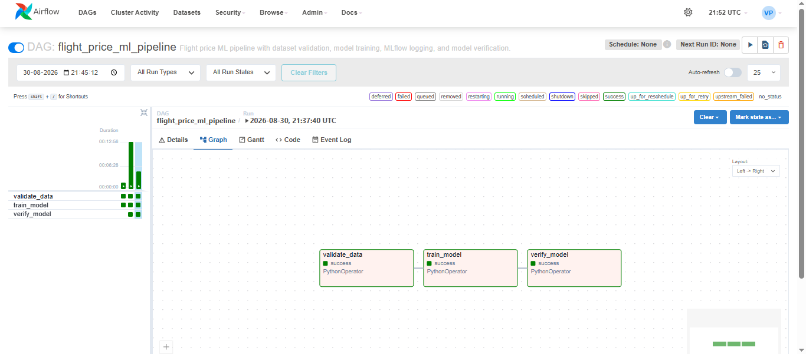
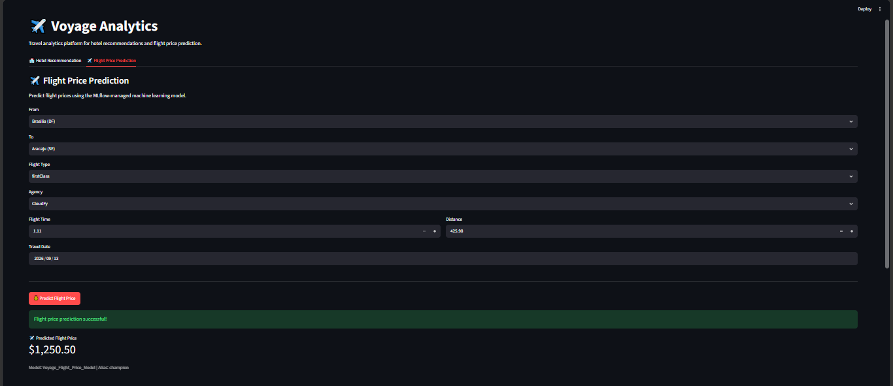
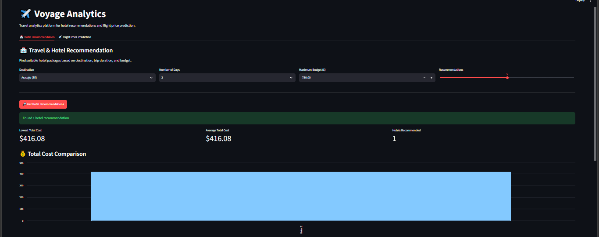
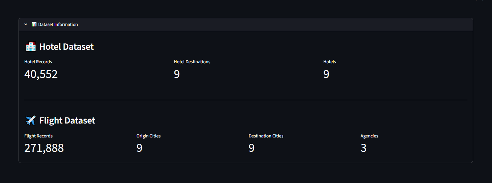
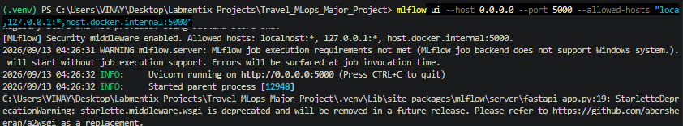
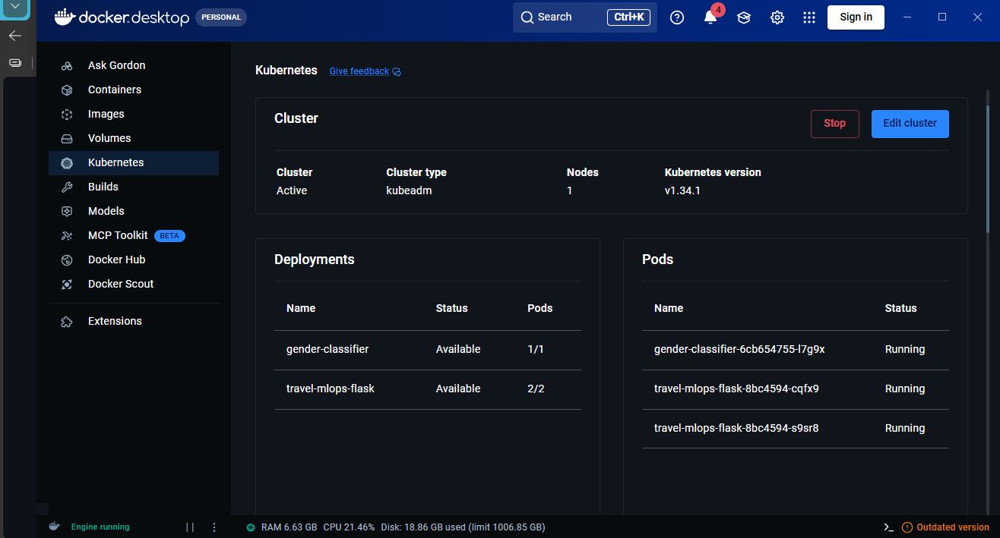

# ✈️ Voyage Analytics

### Travel Analytics, Flight Price Prediction & Hotel Recommendation with MLOps

Voyage Analytics is an end-to-end travel analytics platform that combines **machine learning, MLflow model management, Apache Airflow orchestration, Flask REST APIs, Docker, Kubernetes, HPA, and Streamlit** into a single demonstrable workflow.

The platform provides two user-facing capabilities:

- 🏨 **Hotel Recommendation** — recommends hotel packages using destination, trip duration, and budget.
- ✈️ **Flight Price Prediction** — predicts flight prices using an MLflow-managed LightGBM pipeline exposed through a Flask API and deployed on Kubernetes.

---

## 🚀 Project Highlights

| Area | Implementation |
|---|---|
| Frontend | Streamlit |
| Hotel Recommendation | Pandas-based recommendation engine |
| Flight Prediction | LightGBM regression pipeline |
| Experiment / Model Management | MLflow |
| REST API | Flask |
| Workflow Orchestration | Apache Airflow |
| Containerization | Docker |
| Deployment | Kubernetes (Docker Desktop) |
| Autoscaling | Kubernetes HPA |
| CI/CD | Jenkins |
| Data Processing | Pandas / Scikit-learn |

---

## 🏗️ System Architecture

```text
                         ┌──────────────────────┐
                         │   Travel Datasets    │
                         │ flights.csv          │
                         │ hotels.csv           │
                         └──────────┬───────────┘
                                    │
                     ┌──────────────▼──────────────┐
                     │       Apache Airflow        │
                     │ validate → train → verify  │
                     └──────────────┬──────────────┘
                                    │
                              Model Training
                                    │
                     ┌──────────────▼──────────────┐
                     │           MLflow             │
                     │ experiment tracking         │
                     │ model registry               │
                     │ champion alias              │
                     └──────────────┬──────────────┘
                                    │
                           Production Model
                                    │
                     ┌──────────────▼──────────────┐
                     │        Flask REST API        │
                     │ /health     /predict        │
                     └──────────────┬──────────────┘
                                    │
                            Docker / Kubernetes
                                    │
                     ┌──────────────▼──────────────┐
                     │       Kubernetes Service     │
                     │        + HPA (2–5)           │
                     └──────────────┬──────────────┘
                                    │
                     ┌──────────────▼──────────────┐
                     │       Streamlit UI            │
                     │ Hotel Recommendation         │
                     │ Flight Price Prediction      │
                     └──────────────────────────────┘
```

---

## 🏨 Hotel Recommendation

The hotel module loads the hotel dataset and filters packages according to the selected destination, number of days, and maximum budget.

The recommendation process:

1. Select a destination.
2. Select trip duration.
3. Set the maximum total budget.
4. Select the number of recommendations.
5. Compare total package costs.
6. Review the recommended hotel table.

The application displays hotel prices in **US dollars ($)** to match the project dataset/documentation.

---

## ✈️ Flight Price Prediction

The flight module uses a production LightGBM pipeline managed through MLflow.

The deployed pipeline contains:

- One-hot encoding for categorical features.
- Numerical features passed through the preprocessing pipeline.
- LightGBM regression model.
- MLflow Model Registry with the `champion` alias.

Supported prediction inputs are populated from the flight dataset so that users can select values represented by the trained model vocabulary.

### Prediction flow

```text
Streamlit
   ↓
Flask POST /predict
   ↓
MLflow champion model
   ↓
LightGBM pipeline
   ↓
Predicted flight price
```

---

## 🔄 Airflow Pipeline

The Airflow DAG automates the main flight-model workflow:

```text
validate_data
      ↓
train_model
      ↓
verify_model
```

The pipeline validates the data, trains/logs the model, and verifies the resulting production artifact.

---

## 📊 Dataset

The project uses two primary datasets:

### Hotel Dataset

- **40,552 records**
- **9 destinations**
- **9 hotels**

### Flight Dataset

The Streamlit application reads the flight dataset dynamically and exposes the available origins, destinations, flight types, and agencies to the user.

---

## 🧪 MLflow Model

The production flight model is registered in MLflow as:

```text
Model: Voyage_Flight_Price_Model
Alias: champion
Status: READY
```

The deployed Flask service loads the model through the MLflow Model Registry rather than bundling the model directly into the Streamlit application.

---

## ☸️ Kubernetes Deployment

The Flask prediction API is containerized and deployed to Kubernetes.

Key deployment components include:

```text
Deployment: travel-mlops-flask
Service:    travel-mlops-flask
Type:       NodePort
Port:       5001
HPA:        CPU-based autoscaling
Min Pods:   2
Max Pods:   5
```

Health endpoint:

```http
GET /health
```

Prediction endpoint:

```http
POST /predict
```

Example successful response:

```json
{
  "model": "Voyage_Flight_Price_Model",
  "model_alias": "champion",
  "predicted_price": 1250.50
}
```

---

## 🐳 Docker

The Flask service is packaged as a Docker image and deployed locally through Docker Desktop Kubernetes.

The container exposes port `5001` and connects to the MLflow tracking/model registry service through the Docker host.

---

## 🔁 CI/CD

A Jenkins pipeline is included in the repository for automating the project workflow and productionization steps.

The overall MLOps lifecycle is:

```text
Code
 ↓
Build
 ↓
Validate
 ↓
Train
 ↓
Track with MLflow
 ↓
Register Model
 ↓
Deploy
 ↓
Verify
```

---

## 🖥️ Running the Application Locally

### 1. Activate the virtual environment

```powershell
cd "C:\Users\VINAY\Desktop\Labmentix Projects\Travel_MLops_Major_Project"
.\.venv\Scripts\Activate.ps1
```

### 2. Start MLflow

```powershell
mlflow ui --host 0.0.0.0 --port 5000 --allowed-hosts "localhost:*,127.0.0.1:*,host.docker.internal:5000"
```

Keep this terminal running.

### 3. Verify Kubernetes

```powershell
kubectl get nodes
kubectl get pods -l app=travel-mlops-flask
kubectl get hpa travel-mlops-flask
```

### 4. Start the Flask port-forward

```powershell
kubectl port-forward svc/travel-mlops-flask 5001:5001
```

Keep this terminal running.

### 5. Verify the API

```powershell
Invoke-WebRequest http://localhost:5001/health -UseBasicParsing
```

### 6. Start Streamlit

In another terminal:

```powershell
cd "C:\Users\VINAY\Desktop\Labmentix Projects\Travel_MLops_Major_Project"
.\.venv\Scripts\Activate.ps1
streamlit run streamlit_app.py
```

Open:

```text
http://localhost:8501
```

---

## 📸 Screenshots

### Airflow Pipeline



### Flight Price Prediction



### Hotel Recommendation



### Dataset Information



### MLflow Model Registry



### Kubernetes / HPA



---

## 📁 Project Structure

```text
Travel_MLops_Major_Project/
│
├── app/
│   ├── app.py
│   └── config.py
│
├── dags/
│   └── flight_price_ml_pipeline.py
│
├── scripts/
│   └── train_flight_model.py
│
├── notebooks/
│   ├── 01_flight_price_prediction.ipynb
│   └── 02_gender_classification.ipynb
│
├── travel_capstone_dataset/
│   ├── flights.csv
│   └── hotels.csv
│
├── k8s/
│   └── Kubernetes manifests
│
├── streamlit_app.py
├── Jenkinsfile
├── requirements.txt
├── Dockerfile
└── README.md
```

---

## ✅ Validation Checklist

Before demonstration, verify:

```text
[✓] MLflow UI running
[✓] Model Voyage_Flight_Price_Model registered
[✓] Alias champion available
[✓] Kubernetes node Ready
[✓] Flask pods Running
[✓] HPA available
[✓] /health returns 200
[✓] /predict returns a prediction
[✓] Streamlit loads successfully
[✓] Hotel recommendations working
[✓] Flight predictions working
[✓] Airflow DAG completed successfully
```

---

## 🎯 Demonstration Flow

For a short project demonstration, present the system in this order:

1. **Streamlit dashboard** — show the overall Voyage Analytics interface.
2. **Hotel Recommendation** — change destination/budget and generate recommendations.
3. **Flight Price Prediction** — select a supported route and generate a prediction.
4. **MLflow** — show the registered production model and `champion` alias.
5. **Airflow** — show the successful `validate_data → train_model → verify_model` DAG.
6. **Kubernetes** — show running Flask pods and HPA.
7. **API** — briefly show the `/health` and `/predict` endpoints if time permits.

---

## 🏁 Conclusion

Voyage Analytics demonstrates a complete MLOps workflow for a travel analytics use case, connecting data validation, model training, experiment/model management, API serving, containerization, Kubernetes deployment, autoscaling, and interactive user interfaces into one project.

The result is a practical end-to-end system that can be demonstrated from both the **business/user perspective** and the **MLOps/infrastructure perspective**.

---

## 👤 Author

**Vinay Pandey**

---

⭐ If this project helped you understand production ML workflows, consider starring the repository.
